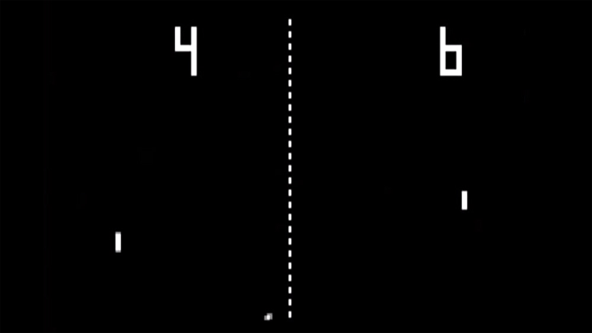
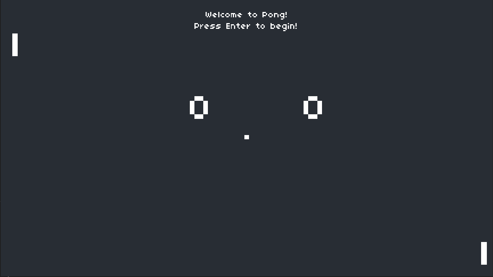
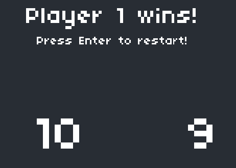

# Pong

Pong is one of the first computer games that ever created. This simple "tennis like" game features two paddles and a ball, the goal is to defeat your opponent by being the first one to gain10 point, a player gets a point once the opponent misses a ball.

## Implementation with Lua

My version of this game has been made with the game engine LOVE2D using the programming language Lua.

### Features

- On the screen there are displayed two paddles representing the players which can be controled by pressing the _w/s_ and _up arrow/down arrow_ keys.

- Along side the paddles, in the middle of the screen, the ball and the scores are displayed. 

- At the top of the screen are some messages welcoming the player and telling him informations about what is currently happening. First of all, the player has to press the _enter_ key to begin the game. Then a message will be displayed telling him to which players serves the ball.

- Every time the ball collides with the paddles, the screen, or a player scores a point a sound will be played.

- When a player earns 10 points a message will be shown.

